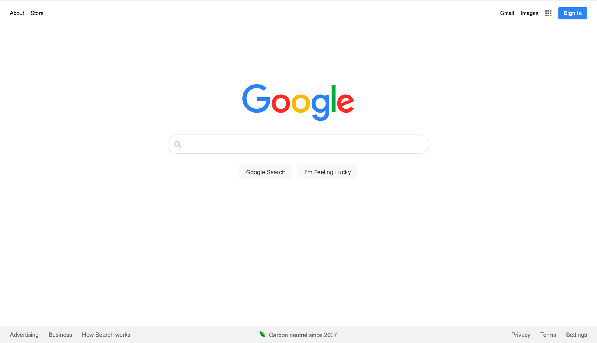
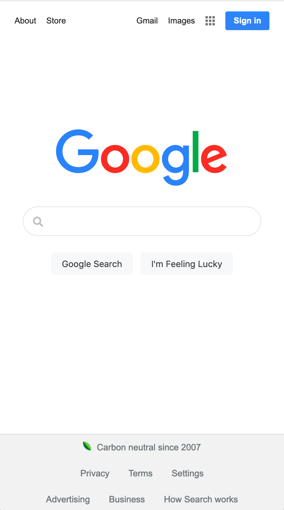
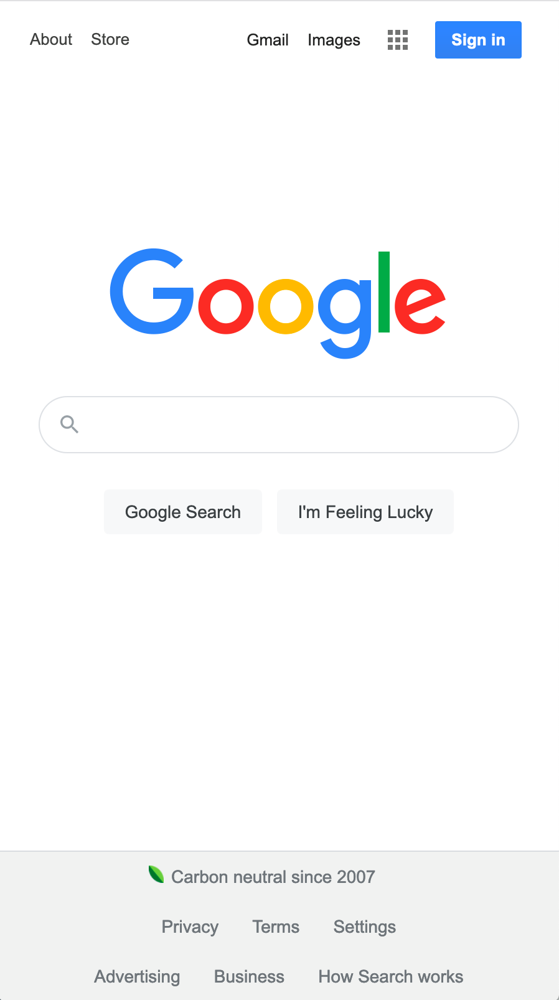

## Google Homepage Clone Project

As the title suggests, the purpose of this project was to create a clone of Google homepage. In the demo below, one of them is my clone project and the other one is from the actual Google page. Can you guess which one is real? (Hint: visit [Google](https://www.google.com/) :eyes: )

---

### Demo: Spot the Difference!

#### Google 1: Desktop

#### Google 2: Desktop

#### Google 1: Mobile (left) & Google 2: Mobile (right)

    
    

---

    
Did you make a decision? Click to reveal the answer!

    <em><b>Google 2</b> is the real Google homepage!</em>

---

Thanks to [The Odin Project](https://www.theodinproject.com/courses/foundations/lessons/html-css) for providing an idea and guidance for this project! :confetti_ball:
